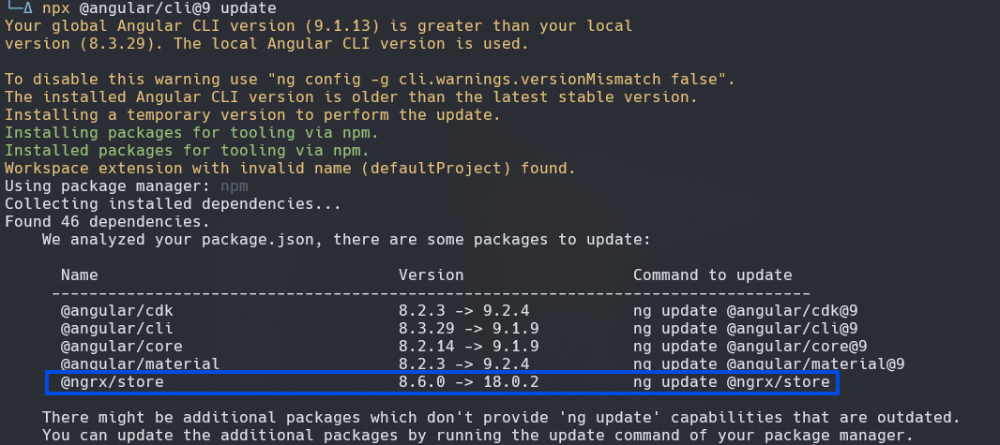

## Work in progress

Hoping to create a collection of my journeys into learning new things.

> Starting with [`journeys` is not spelt `journies`](https://www.grammar-monster.com/plurals/plural_of_journey.htm) as I originally thought 😁.

I would like to make this into multiple sub-pages, but the site currently does not have that kind of functionality. I still need to [figure out how I want to achieve that](https://github.com/peterjokumsen/peterjokumsen-nx-workspace/issues/24) 🏗️.
So for now, I will just keep everything to this page.


> _Discontent is the first necessity of progress._  
> **Thomas Edison**
>
> Image by [mostafa meraji](https://pixabay.com/users/mostafa_meraji-13551092/?utm_source=link-attribution&utm_medium=referral&utm_campaign=image&utm_content=5243951) from [Pixabay](https://pixabay.com//?utm_source=link-attribution&utm_medium=referral&utm_campaign=image&utm_content=5243951)

## Attempting to break a bad habit

I find myself repeating a kind of `developer strat`, that goes something like this:

- Find documentation 🔍
- _Scan_ documentation 🫣😎
- Copy code block from the first thing that seems relevant to my circumstance 🤷
- Paste code block into my project 🤖
- Run project 🏃‍♂️‍➡️
- Start a 1-3 hour back and forth with the browser dev tools, trying to figure out why the code I copied isn't working 🚶‍♂️‍➡️
- Realize I have spent a lot of time incorrectly assuming the context of the code that I've copied, adjust my assumption(s) and try again ♻️
- Reach a point where project is looking alright 🤠
- Refactor changes 🧹
- Break everything 🤡
- Reconsider life choices 🫠
- Start again with more knowledge at hand 🧑‍🎓

This is the happy case of when I don't chase any squirrels to procrastinate, which is something I've kind of done already with all of the emojis I've used in the list above.

To try and reduce this bad habit of mine, I plan to update this document with a basic target of what I hope to achieve and follow that up with documentation on the steps taken and lessons learned. Which should hopefully keep me on track **and** document things for review 🤞

## Week 1 - Angular Material theming

I absolutely love [Angular Material](https://material.angular.io), but I consistently run into issues with theming.

While I don't think that [Angular Material theming](https://material.angular.io/guide/theming) is particularly difficult,
I find that **every time** I need to do it, I get it 70% done and call it there. And when it ends up being something that I need to revisit, I've forgotten most of what I previously learnt.

So this practice, should absolutely help me out with this. Let me set some basic goals:

- Read through the documentation
- Use Angular Material theming in a fresh project with 4 or more Material components used
- Add 2 extra themes with basic approach to switching themes

**To be completed by: 12/09/2024, with updates here at least every 2 days**

## Week 1 - 1/3 - Start

I have not made any progress, unfortunately... but going to put something together so that there is something going on (And if I don't get things done, I'll just have to re-adjust 🤷)

To really play around with theming, would like to great a simple standalone project for this purpose... And also play around with `Angular CLI`, since most of my time has been spent using `Nx`.

Created [ng-playground repository](https://github.com/peterjokumsen/ng-playground). Thinking that I will try and do most of my changes in separate branches. Hopefully next update will be more details on using Angular Material.

## Week 1 - 2/3 - Squirrel!

I haven't been able to do anything related to learning about Angular Material theming 🤦🏻😅

I've spent the past 2 evenings upgrading an older Angular project from v8.2 to v16, which has been an experience of it's own...

Using [Angular upgrade guide](https://angular.dev/update-guide?v=8.2-17.0&l=3) makes the process relatively painless, but I did hit a few snags:

The guide did not allow me to take `@ngrx/store` into account, which `ng update` command included in the list of packages it could update but only show next update as `18.0.2`:



With this I ended up going with using the guide approach of first updating `@angular/core` and `@angular/cli`

```bash
npx @angular/cli@9 update @angular/core@9 @angular/cli@9
```

Followed by updating `@angular/cdk` and `@angular/material`, with the addition of `@ngrx/store` for the current major version being updated to:

```bash
npx @angular/cli@9 update @angular/cdk@9 @angular/material@9 @ngrx/store@9
```

This approach had a few hiccups from 9 to 12, although I was unable to run tests for the project which I believe was primarily due to me using `Node v20`. After updating to 16, I was finally able to run tests in the project and tweak things to get them passing.

My next steps is to check if it actually functions properly 🤞 I'm hoping the passing tests are a good sign, but with the last commit for the project being 24 August 2022 I am pretty sure I'm going to have a few headaches reading my old code.

Hopefully will get back to Angular Material theming in the very near future. Overall, it's been a decent week at least.
