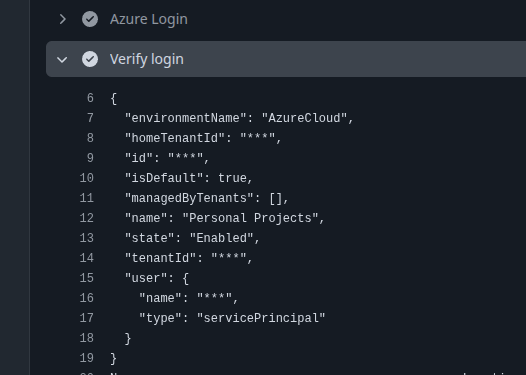

## The goal

I would like to get my intermediate certification in Azure before the end of the year.

To try and get that done, plan to use this as a way to keep track of my progress and document what I learn.

> A sort of cheat sheet, if you will.

## The plan

Work on a personal project leveraging the majority of elements being tested:

- Azure web services (ACA and Functions)
- Azure Cosmos DB
- Azure Redis cache

With an emphasis on using CLI and Biceps for deployments.

## Step 1. OIDC integration

### Create service principal

Started the process by trying to get the GitHub actions, to be used for automation, properly authenticated.

```bash
# Register the application
APP_ID=$(az ad app create --display-name <appName> --query appId -o tsv)

# Create a service principal for the application
az ad sp create --id $APP_ID

# Get the service principal object ID
SP_OBJECT_ID=$(az ad sp show --id $APP_ID --query "id" -o tsv)
```

### Create federated-credential

With that completed, need to create a `federated-credential`

```bash
# Create federated credential for the main branch
az ad app federated-credential create --id $APP_ID --parameters '{
  "name": "github-main-branch",
  "issuer": "https://token.actions.githubusercontent.com",
  "subject": "repo:myorg/myrepo:ref:refs/heads/main",
  "description": "GitHub Actions - main branch",
  "audiences": ["api://AzureADTokenExchange"]
}'

# Create federated credential for pull requests
az ad app federated-credential create --id $APP_ID --parameters '{
  "name": "github-pull-requests",
  "issuer": "https://token.actions.githubusercontent.com",
  "subject": "repo:myorg/myrepo:pull_request",
  "description": "GitHub Actions - pull requests",
  "audiences": ["api://AzureADTokenExchange"]
}'

# Create federated credential for a specific environment
az ad app federated-credential create --id $APP_ID --parameters '{
  "name": "github-production-env",
  "issuer": "https://token.actions.githubusercontent.com",
  "subject": "repo:myorg/myrepo:environment:production",
  "description": "GitHub Actions - production environment",
  "audiences": ["api://AzureADTokenExchange"]
}'
```

### Assign role

Assign `Contributor` role for the app:

```bash
# Get your subscription ID
SUBSCRIPTION_ID=$(az account show --query "id" -o tsv)

# Assign Contributor role at the resource group level
az role assignment create \
  --assignee $APP_ID \
  --role "Contributor" \
  --scope "/subscriptions/$SUBSCRIPTION_ID/resourceGroups/my-resource-group"
```

### Add secrets in GitHub

Add `AZURE_CLIENT_ID ($APP_ID)`, `AZURE_TENANT_ID ()`, and `AZURE_SUBSCRIPTION_ID ($SUBSCRIPTION_ID)` as secrets for GitHub repository.

### Update GitHub action to validate OIDC

```yaml
# .github/workflows/deploy.yml
name: Deploy to Azure

on:
  push:
    branches: [main]

# These permissions are required for OIDC token generation
permissions:
  id-token: write # Required for requesting the OIDC JWT
  contents: read # Required for actions/checkout

jobs:
  deploy:
    runs-on: ubuntu-latest
    environment: production # Must match the federated credential subject

    steps:
      # Check out the repository code
      - uses: actions/checkout@v4

      # Authenticate to Azure using OIDC
      - name: Azure Login
        uses: azure/login@v2
        with:
          client-id: ${{ secrets.AZURE_CLIENT_ID }}
          tenant-id: ${{ secrets.AZURE_TENANT_ID }}
          subscription-id: ${{ secrets.AZURE_SUBSCRIPTION_ID }}

      # Verify the login worked
      - name: Verify login
        run: |
          az account show
          az group list --output table
```



> Az login successful! 🎉

## Step 2. Deploy initial resources

> To be worked on
